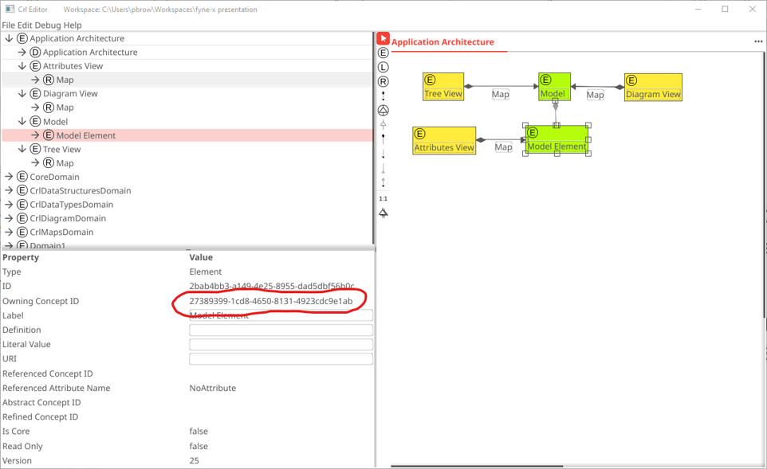

# ActiveCRL

The [Concept Representation Language](https://ieeexplore.ieee.org/document/8334433) (CRL) is a language for uniformly representing any and all formal languages and the mappings between them. While the language is very expressive, it carries with it two limitations: 
* The CRL structure is inherently a network (think of it as a forest of trees with links between nodes of different trees). The problem is that networks are difficult for people to percieve when expressed in textual form.
* To be useful, the CRL structure must be interpreted. This requires a mechanism to walk the network (or at least portions of it) and do something useful with the information beting represented.

ActiveCRL is an extension to CRL that provides two additional capabilities:
* The ability to visualize and edit CRL representations graphically (i.e. an IDE for CRL)
* The ability to associate a function with any node of a CRL representation. This function can walk the network, starting from the assiciated node, and manipulate the network. 

The current incarnation of ActiveCRL is built with the go-based [fyne GUI library](https://github.com/fyne-io/fyne) and a DiagramWidget extension to [fyne-X - public extensions to fyne](https://github.com/fyne-io/fyne-x). 

ActiveCRL includes an Interactive Development Environment (IDE):
* [ActiveCRL IDE](./crlfyneide/main.go) 

 

## A Bit Of History
The core language for the ActiveCRL implementation is Go. However, in 2017 Go did not have a user interface capability rich enough to support the development of an interactive IDE. 
* Prototype 1: The popular approach at the time appeared to be to build the interface using browser technologies (i.e. JavaScript). Since the gopherjs library provides a cross-compiler from Go to Javascript, an initial prototype IDE was developed using this technology. This prototype encountered two limitations:
  * Go was very difficult to debug in cross-compiled form
  * Browser-based applications (at least when running in a browser) cannot do the file creation/storage/retrieval actions required by an IDE. This seems obvious in retrospect, but did not arise as an issue until the IDE had developed to the point where storage became a requirement.
* Prototype 2: Another popular approach (a year later) appeared to be developing a user interface in a browser that interacted with a back-end server process. The second prototype took this approach, with the back end written in Go and the front end written in JavaScript. While this approach has yielded a working IDE, it has some drawbacks:
  * Despite the use of multiple JavaScript libraries, more than 75% of the ActiveCRL-specific code is JavaScript, not Go.
  * Significant time is required to comprehend the various JavaScript libraries and develop approaches to making them provide the required functionality
  * Limitations of the JavaScript libraries are making it hard to implement desired IDE functionality, such as multiple-element select in a diagram.
* Prototype 3 (current work): The selection of existing JavaScript libraries was an attempt to avoid the work involved in developing a full-scale graphical IDE from scratch. In retrospect, the level of effort that has been invested in utilizing these JavaScript libraries is beginning to approach the level of effort used to build a full-blown IDE: [Satisfying the graphical requirements of visual languages in the DV-Centro Framework](https://ieeexplore.ieee.org/document/626562). Realizing this, it was decided to add a second GUI to the prototype based on [Fyne](https://fyne.io/). Initially this work focused on reproducing the browser-based capabilities using Fyne. Once the Fyne implementation supported all the capabilities of the browser-based GUI, the browser-based GUI was retired. As with the browser-based approach, the use of Fyne will provide the ability to execute in multiple environments. More importantly, this work will provide a platform-independent deployment approach for future ActiveCRL applications requiring user interfaces.

